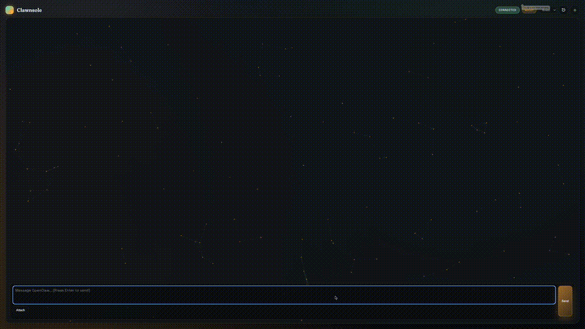

# Clawnsole

A live, visual chat console for OpenClaw. It connects directly to the local
gateway and renders an interactive chat experience.

## Demo



[Watch the demo](assets/clawnsole-demo.mov)

## One-line install

```bash
curl -fsSL https://raw.githubusercontent.com/rmdmattingly/clawnsole/main/scripts/install.sh | bash
```

The installer will prompt for admin/guest passwords and will install a
LaunchAgent to auto-start Clawnsole on login.
You can also enable automatic updates (LaunchAgent).
It will expose a nice local URL at https://clawnsole.local (macOS + sudo required).
(HTTP redirects to HTTPS; HTTPS uses a local/internal Caddy certificate.)

### HTTPS
If you’re trying to access a QA/hosted Clawnsole instance over **https** and see `ERR_SSL_PROTOCOL_ERROR`, you likely need TLS termination in front of the app (Caddy/nginx). See: [`docs/HTTPS.md`](./docs/https-tls.md)

You can override defaults:

- `CLAWNSOLE_REPO` (repo URL)
- `CLAWNSOLE_DIR` (install location)
- `OPENCLAW_HOME` (default: `~/.openclaw`)

## One-line update

```bash
curl -fsSL https://raw.githubusercontent.com/rmdmattingly/clawnsole/main/scripts/update.sh | bash
```

**Deploy hardening:** the updater now does a *staging health check* **and** a *login-flow verification* on the new (blue/green) instance **before** cutting Caddy over. If login breaks, the update aborts and leaves the previous version serving traffic.

## Uninstall

```bash
curl -fsSL https://raw.githubusercontent.com/rmdmattingly/clawnsole/main/scripts/uninstall.sh | bash
```

You can also run:

```bash
curl -fsSL https://raw.githubusercontent.com/rmdmattingly/clawnsole/main/scripts/install.sh | bash -s -- --uninstall
```

## Connect

- WS URL (local dev): `ws://127.0.0.1:18789`
- Token: auto-fetched from `~/.openclaw/openclaw.json` via `/token`

Notes:
- `ws://` is only intended for localhost development.
- For remote access, use TLS (`https://` + `wss://`) via a reverse proxy. See [`docs/HTTPS.md`](docs/HTTPS.md).
- The proxy refuses non-localhost `ws://` by default (set `CLAWNSOLE_ALLOW_INSECURE_TRANSPORT=1` for dev-only).

The UI sends a `connect` request on the first frame, as required by the gateway
protocol.

## HTTPS / TLS

Clawnsole's Node server (`server.js`) serves **HTTP only**.

If you need `https://` access, terminate TLS in front of Clawnsole using a
standard reverse proxy (recommended: **Caddy**).

See: [`docs/HTTPS.md`](docs/HTTPS.md)

## Password protection (optional)

Passwords live in `~/.openclaw/clawnsole.json`. The installer sets these for you,
but you can update them manually too:

```json
{
  "adminPassword": "your-strong-password",
  "guestPassword": "guest-password"
}
```

Clawnsole uses HTTP Basic auth; any username is accepted, the password must match.
If omitted, admin defaults to `admin` and guest defaults to `guest`.

## Notes

- Existing OpenClaw sessions keep their model. Start a new session to pick up a
  new default.
- Clawnsole stores your token and device ID in localStorage for convenience.

## Workqueue: agent→queue assignments + claim-next defaults

Clawnsole's workqueue supports assigning agents to queues, and letting `claim-next`
resolve queues automatically when you omit them.

### Defaults

- `CLAWNSOLE_DEFAULT_QUEUES` (comma-separated, default: `dev-team`)

### CLI

```bash
# Persist assignment in the workqueue state file
node bin/clawnsole.js workqueue assignments set --agent dev-3 --queues dev-team,qa
node bin/clawnsole.js workqueue assignments list

# If --queues is omitted, claim-next resolves:
# requested queues → assignment → CLAWNSOLE_DEFAULT_QUEUES
node bin/clawnsole.js workqueue claim-next --agent dev-3
```

### HTTP API (admin-only)

- `POST /api/workqueue/claim-next` — `queues` is optional. If omitted, the server
  uses the same resolution behavior as the CLI.
- `GET /api/workqueue/assignments` / `POST /api/workqueue/assignments`

<details>
<summary>Developers: run locally</summary>

```bash
cd /Users/raysopenclaw/src/clawnsole
npm run dev
```

Then open http://localhost:5173 in a browser.
</details>

## QA vs Prod (local)

If you want a stable Prod instance while iterating in QA, run them on different
ports and set `CLAWNSOLE_INSTANCE` so their auth cookies do not collide.

```bash
# Prod (stable)
CLAWNSOLE_INSTANCE=prod PORT=5173 npm run dev

# QA (fast iteration)
CLAWNSOLE_INSTANCE=qa PORT=5174 npm run dev
```

Connect:

- Prod: `http://localhost:5173/admin` (or `/guest`)
- QA: `http://localhost:5174/admin` (or `/guest`)

If QA keeps dying due to terminal logout / SIGTERM, run it as a managed service (macOS LaunchAgent):

```bash
cd ~/src/dev/clawnsole
./scripts/install-qa-launchagent.sh
```

Runbook + health check: [`docs/DEPLOY.md`](./docs/DEPLOY.md)

## Recurring Agent Prompts (external scheduler)

Clawnsole can store recurring prompts targeted at individual agents. Delivery is handled by an **external** scheduler process (e.g. systemd timer / launchd / cron), not OpenClaw cron.

1) In Clawnsole (Admin) open **Gateway Link** → **Recurring Agent Prompts** and create prompts.

2) Run the scheduler (example: once per minute):

```bash
node scripts/recurring-prompts-scheduler.js --once
# or loop
node scripts/recurring-prompts-scheduler.js --loopSeconds 60
```

Prompts are stored in `~/.openclaw/clawnsole-recurring-prompts*.json` (instance-aware).
